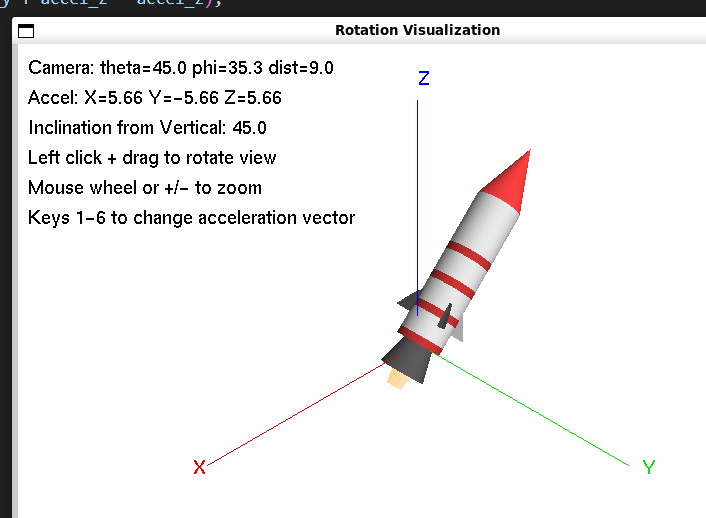

# Transformation-Visualizer
An OpenGL visualizer for transformation matrices and inclination angles derived from triaxial accelerometers.

### Compilation and Execution
1. ```sudo apt install freeglut3-dev```
2. ```gcc accel_transforms.c -o accel_transforms -lGL -lGLU -lglut -lm```
3. ```./accel_transforms```



